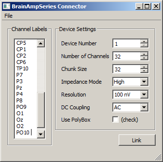
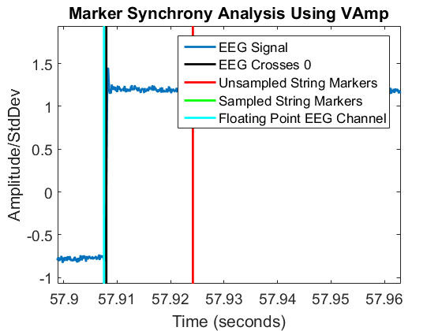
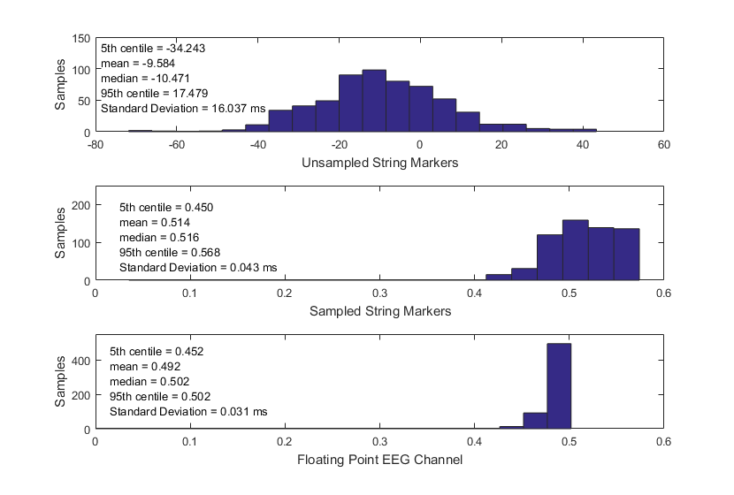
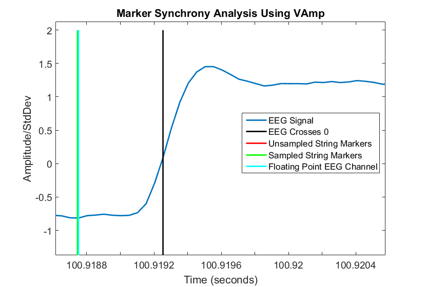
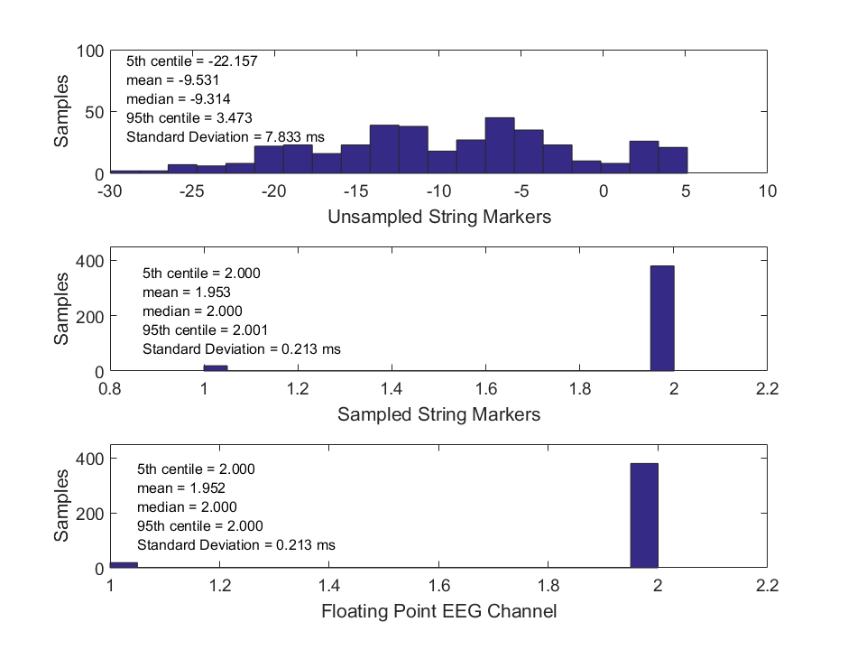

# Usage

1. Make sure that you have correctly installed the drivers for your amplifier, and that the amplifier is plugged in, turned on, and batteries are charged (see also official brochure).
  * Start the BrainAmpSeries app. You should see a window like the following.
> 

2. If you have multiple amplifiers plugged in, make sure that you pick the correct one under Device Number (1 is the first one according to USB port numbering). Select the number of channels that you want to record from and enter the channel labels according to your cap design; make sure that the number of channel labels matches the selected number of channels.

3. For most EEG experiments you can ignore the Chunk Size setting, but if you are developing a latency-critical real-time application (e.g., a P300 speller BCI), you can lower this setting to reduce the latency of your system. Also, for most applications it is recommended to leave the Impedance Mode and DC coupling options at their defaults. Further information is found in the amplifier's manual (and/or the BrainVision recorder manual).

4. If you have strong noise sources or you observe clipping of your recorded signal, you can change the resolution setting to a coarser stepping.

5. If you use the PolyBox, check the according box and prepend 8 channel labels at the beginning of the channel list (even if you only use a subset of them). Note that the PolyBox is not the same as the EMG box or other accessories.

6. Click the "Link" button. If all goes well you should now have a stream on your lab network that has name "BrainAmpSeries-0" (if you used device 0) and type "EEG", and a second one named "BrainAmpSeries-0-Markers" with type "Markers" that holds the event markers. Note that you cannot close the app while it is linked.

## Configuration file

The configuration settings can be saved to a .cfg file (see File / Save Configuration) and subsequently loaded from such a file (via File / Load Configuration). Importantly, the program can be started with a command-line argument of the form "BrainAmpSeries.exe -c myconfig.cfg", which allows to load the config automatically at start-up. The recommended procedure to use the app in production experiments is to make a shortcut on the experimenter's desktop which points to a previously saved configuration customized to the study being recorded to minimize the chance of operator error.

# Marker types

In the latest version of the Brain Products LSL clients (with the exception of
the RDA Client), there is a new feature that allows the user to choose in what
form of marker LSL will output an amplifier's trigger signal(s).

There are three options: **Unsampled Markers**, **Sampled Markers**, and
**Floating Point EEG Channel**.

## The Problem With Unsampled Markers

In general, there are two kinds of LSL outlets: marker outlets and signal
outlets.
Signal outlets emit digitally sampled data 'continuously' at a set sampling
rate whereas marker outlets emit data sporadically, whenever a marker is
supposed to occur.

A trigger signal, however, is an analog signal.
It is digitally sampled by an amplifier (or any other device that supports
trigger i/o) and this signal is handed to the LSL client along with the signal
as a chunk of bytes.
The LSL client must then decode this chunk of binary data and reorganize it as
whatever kind of data structure is appropriate to send through an LSL outlet.

To emit a trigger signal through a marker outlet, the LSL client must determine
when the new trigger value arrives and attach that timestamp to the marker.
This is what is meant by **Unsampled String Markers**.

The problem is that when LSL performs its timestamp synchronizing routines,
unsampled marker streams do not get dejittered: they are sporadic, to dejitter
them is not appropriate since they may occur at random.
Sampled streams (such as an EEG signal, do get dejittered because there is
naturally some jitter in the timestamps that are attached to an signal or
marker stream.
This means that the unsampled markers are not synchronized with the signal.
This is bad.

A solution to this problem was first implemented by Ole Traupe for the RDA
client.
Instead of chopping up the trigger byte stream into sporadic markers, he
simply created an outlet to emit a steady stream of strings at the same
sampling rate as the EEG signal itself.

The samples are empty unless a change in the trigger signal has occurred, in
which case the sample is a string that represents the new value in the trigger
signal.
This is what is meant by **Sampled String Markers** and this is the default
setting on the Brain Products LSL client applications.

This solution is elegant and makes analysis simple since the person making
the analysis can simply read off the markers that correspond to the trigger
channel. However, there is still some jitter. It is not exactly synchronized
with the EEG, which is bad because
*the trigger signal is exactly synchronized with the EEG signal in the*
*amplifier*.

So, to achieve better synchrony, it was proposed to simply add an extra
channel to the LSL EEG stream that corresponds to changes in the trigger
stream value coming out of the amplifier. The problem there is that the data
is now in the same format as the EEG signal (32 bit floating point numbers).
This is what is meant by **Floating Point EEG Channel**.

## Validation

In order to test the time accuracy of the 3 marker types, a SIGGI signal
generator was used to feed a square wave signal and a trigger into a VAmp
amplifier.
The trigger goes 'high' (voltage flows through each pin on the serial port
excepting ground) precisely when the EEG signal (aforementioned square wave)
goes high.
Using the VAmp LSL client, all 3 marker types were recorded alongside the EEG
signal. In the analysis, the square wave was normalized and the
times at which it crossed 0 were noted. These times were then compared with
each of the marker streams.

The green line for Sampled String Markers is covered by the cyan line for
Floating Point EEG Channel because they occur within several microseconds of
each other.

Figure 2 shows histograms of the difference between the time points
at which the EEG signal crosses 0 and when each of the 3 marker types occurs.
The median latency is .5ms or so in the bottom two plots. This constant offset
is due to the fact that the trigger is emitted slightly before that at which
the signal starts to go high.
This is before the time at which the signal crosses 0.
The extreme close-up in Figure: 3 illustrates the situation.

The recording was not long. Only 5 minutes of data was recorded, so this
is just a taste of the true performance and not a definitive answer.
For that, a much longer recording would be necessary. I hypothesize that if an
hour long recording was taken and analyzed using the same method the latency of
the Floating Point EEG Channel markers would remain extremely consistent.
The width of the Sampled String Markers would also improve slightly, as that
jitter is an artifact of the fact that it is an LSL stream separate from the
EEG and there is (due to math) a small skewing of the timestamp data between
any two streams in the de-jittering process (hard thresholding will only
provide so accurate an answer to the question of 'when does a square wave go
high in a digital signal?') and the signal generator itself (which I haven't
measured, but is presumable very near to nothing).

We also note that the Sampled String Markers are very nearly synchronized with
the Floating Point EEG Channel markers.
That difference is shown in Figure 4.

A similar result is shown in a recording of LiveAmp running at 1kHz (Figure 5).
Here we see almost perfect simultaneity between the Sampled String Markers and
the EEG.

## RDA Client

As mentioned above, the RDA client does not support the Floating Point EEG
Channel marker option.

This is because due to the fact that Recorder emits
markers as strings (as opposed to VAmp etc. which emit trigger signals as byte
streams) to implement such a solution would require encoding the marker strings
as floating point numbers and then back again.
This is somewhat unwieldly since it is unclear as to what string markers would
ever be emitted and the encoding would have to be recorded.
There are several ways to do this (discussions abound), but none are friendly.
It is clear though that both the Sampled String
Markers are a significant improvement over the Unsampled String Markers.
